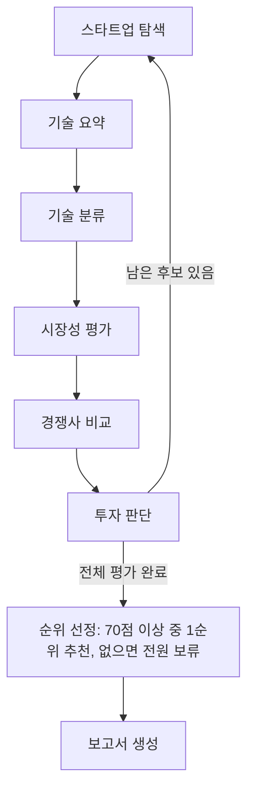

# AI Startup Investment Evaluation Agent

본 프로젝트는 Semiconductor(AI 반도체) 스타트업에 대한 투자 가능성을 자동으로 평가하는 에이전트를 설계하고 구현한 실습 프로젝트입니다.

## Overview

- Objective : AI 반도체 스타트업 20개(국내 10, 해외 10)의 시장성, 제품/기술력, 경쟁 우위, 성장가능성, 투자조건 등을 기준으로 투자 적합성 분석
- Method : LangGraph Multi Agent, Agentic RAG(기술 요약·기술 분류·시장성 평가), 웹 검색(경쟁사 비교), LLM Judge(투자 판단)
- Output : 전체 후보 평가 후 70점 이상 기업 중 1순위를 추천(없으면 전원 보류)하고 5페이지 PDF 투자 보고서 생성

## Features

- PDF·웹 자료 기반 정보 추출: 기업 홈페이지·제품 문서·논문·보도자료(179페이지) + 시장조사 보도자료(21페이지) = 200/200페이지
- 모든 주장에 출처 URL·페이지·원문 인용을 붙이고 원문에 없는 인용은 제거, 근거가 없으면 `근거 부족`
- 기술 분야에 맞는 세부 시장(엣지 AI·데이터센터 가속기·CXL·포토닉스·인메모리·칩렛) 규모·성장률 분석
- 경쟁사 2~3곳을 웹 검색으로 찾아 제품·성능·고객·특허·파트너십·양산 역량별 비교
- 설계서 Score Table·체크리스트(100점)로 채점, 항목별 한 줄 이유, 기술·운영·법률 치명 리스크 유형별 −10점
- 3회 채점 중앙값으로 LLM 채점 변동 완화, 핵심 정보가 부족하면 보류
- 에이전트 결과만으로 5페이지 한국어 보고서(표·그래프·인용 번호·가이드 형식 Reference) 생성
- 검색 품질 평가(Hit Rate@K, MRR)와 노드별 경과 출력

## Tech Stack

- Framework : LangGraph
- LLM/Generator : OpenAI gpt-4o-mini (temperature 0)
- LLM/Judge : OpenAI gpt-4o-mini (3회 채점 항목별 중앙값)
- Retrieval : FAISS (IndexFlatIP) - 기술 Hit Rate@3 0.978, MRR@10 0.923 (46문항) / 시장 Hit Rate@3 0.938, MRR@5 0.745 (16문항)
- Embedding : nlpai-lab/KURE-v1(한국어), jinaai/jina-embeddings-v5-text-small(영문·장문) 하이브리드
- Web Search : Tavily / PDF : pypdf, Playwright, ReportLab

## Agents

- 스타트업 탐색 : 팀이 검증한 후보 20개의 비상장·Seed~Series C·Exit 미완료 적격성 확인
- 기술 요약 (RAG) : 기술 문서에서 핵심 기술·차별성·장점·한계·상용화 상태를 인용과 함께 정리
- 기술 분류 (RAG) : NPU·AI 가속기·GPU·CXL·포토닉스·인메모리 연산 등 분야 분류 (라벨-근거 일치 검사)
- 시장성 평가 (RAG) : 세부 시장 보고서에서 시장 규모·CAGR·대상 고객·수요처 정리
- 경쟁사 비교 : 웹 검색으로 경쟁사 2~3곳과 6개 항목 비교, 진입장벽 정리
- 투자 판단 : Score Table·체크리스트 채점, 리스크 감점, 기준(70점) 통과 여부와 근거 기록 → 전체 평가 후 순위 선정
- 보고서 생성 : 최종 State로 Summary·시장·기업·성장/리스크·Reference 5페이지 PDF 작성

## Architecture



<sub>**설계서 대비 변경 사항**<br>
① 그래프: 첫 추천 기업에서 종료 → 20개사 전체 평가 후 70점 이상 기업 중 1순위 추천(없으면 전원 보류), `final_ranking`·`recommended_startup` 추가<br>
② State: 반복 제어·근거 전달용 필드 추가(`candidate_index`, `evaluation_history`, `source_evidence`, `evaluation_details` 등)<br>
③ 평가: 추천 기준선 70점 확정, 리스크는 기술·운영·법률 유형별 −10점, 3회 채점 중앙값 사용<br>
④ 핵심 정보: 기술 요약 필수 항목은 핵심 기술만(차별성은 점수표에서 평가)<br>
⑤ 임베딩: 언어별로 모델을 나누는 대신 두 모델로 모두 인덱싱하고 질문 특성에 따라 0.7/0.3 가중 결합<br>
⑥ 스타트업 탐색: 웹 검색 대신 팀이 검증한 후보 20개를 적격성 규칙으로 확인</sub>

## Directory Structure

```text
├── data/                  # 후보 목록, 기술·시장 자료 목록, 검색 정답셋
├── src/investment_scout/
│   ├── agents/            # 탐색·기술 요약·기술 분류·시장성·경쟁사·투자 판단 에이전트
│   ├── rag/               # 수집·파싱·청킹·임베딩·FAISS 검색·생성(프롬프트)·평가·통합 실행
│   ├── reporting/         # 보고서 내용 추출·5페이지 PDF·그래프 노드
│   ├── nodes/             # 후보 선택·평가 저장·순위 선정
│   └── graph.py, state.py # LangGraph 그래프와 State
├── docs/                  # 기술 RAG·역할 3·보고서 상세 안내, 그래프 흐름
├── tests/                 # 단위·통합 테스트 (API 호출 없음)
├── out/                   # 수집 PDF·인덱스·최종 State (Git 제외)
├── output/pdf/            # 투자 보고서 PDF (Git 제외)
├── app.py                 # 실행 스크립트
└── README.md

```

## Usage

```bash
# 1) 설치 (최초 1회)

uv sync --extra tech-rag --extra embeddings --extra live-search --extra report --group dev
uv run python -m playwright install chromium --only-shell
cp .env.example .env   # OPENAI_API_KEY, TAVILY_API_KEY 입력

# 2) 실행: 자료 준비(최초 1회 자동) → 20개 기업 평가 → output/pdf/investment_report.pdf

uv run python app.py
uv run python app.py --max-candidates 3   # 앞의 3개 기업만 빠르게 확인
uv run python app.py --report-only        # 저장된 결과로 보고서만 다시 생성 (API 호출 없음)

# 테스트

uv run pytest -q

```
실행 중 에이전트마다 산출 결과(주장·인용 페이지, 세부 시장, 경쟁사, 항목별 점수와 이유, 최종 순위)가 출력됩니다. 웹 자료와 OpenAI 응답은 시점에 따라 달라질 수 있어 점수·순위가 실행마다 조금씩 다를 수 있습니다. 상세 안내: [기술 RAG](docs/tech_rag.md) · [시장·경쟁·투자 판단](docs/role3.md) · [보고서](docs/report_role4.md)

## Contributors

- 신한수 : (예비군 훈련으로 인한 불참)
- 안영준 : 보고서 생성 Agent 개발, LangGraph 통합, PDF 시각화, Score & Citation 검증, 통합 테스트
- 정하윤 : 스타트업 탐색 Agent, 후보 순환·조건 분기 그래프, 후보 스타트업 선정·적격성 검증(국내 10 / 해외 10)
- 손수경 : PDF & Web Parsing, 문서 Chunking, KURE/Jina모델 활용 Embedding, FAISS Retrieval, Technical Summary & Classification Agents개발
- 손경락 : 기술 RAG 개선·검색 품질 평가, 시장성·경쟁사 비교·투자 판단 Agent 개발, 평가 기준 구현·순위 선정, 보고서 생성 Agent 수정, README 작성
