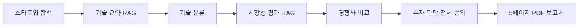

# AI Startup Investment Evaluation Agent

본 프로젝트는 Semiconductor 스타트업의 투자 가능성을 평가하는 에이전트를 설계하고 구현한 실습 프로젝트입니다. 후보 탐색, 기술 RAG, 시장·경쟁·투자판단과 역할 4의 5페이지 PDF 보고서 생성을 연결할 수 있습니다.

## Overview

- Objective: 20개 후보 기업을 탐색하고 기술·시장·경쟁 근거로 채점한 뒤 투자 판단과 5페이지 보고서 생성
- Method: LangGraph 에이전트와 PDF·웹 문서 기반 RAG
- 범위: 후보 탐색 → 기술 RAG·분류 → 시장성·경쟁사 → 투자 판단·순위 → PDF 보고서

## Progress

- 20개 기업의 자료 URL 31개를 등록하고, 웹 문서를 PDF로 저장해 기술 자료 **182페이지**를 수집했습니다. 검색 가능한 Mobilint 양자화 특허 3페이지와 Semunite·Pebble Square·XCENA·BOS의 기사·보도자료가 포함됩니다.
- 20개 기업 모두 검색 가능한 본문이 있습니다. 공식 사이트가 차단(HTTP 403)되거나 인증서 오류인 URL 6건은 수집 실패로 기록됩니다.
- 기술 182페이지와 시장 18페이지를 합쳐 **200/200페이지**로 관리합니다. 기술·시장 자료는 각각 KURE/Jina FAISS 인덱스로 검색합니다.
- 시장 결과는 `market_size`, `growth_rate`, `customer_demand`를 필수로 검증하고, 출처가 범위를 명시할 때만 `tam`, `sam`을 별도 저장합니다. 시장 전체 규모를 기업의 TAM/SAM으로 임의 변환하지 않습니다.
- 20개 기업 46문항 정답셋(`data/retrieval_eval.json`)으로 검색 품질을 측정했습니다. 하이브리드 검색은 **Hit@1 0.870, Hit@3 0.978, MRR@10 0.923**으로 KURE 단독(MRR 0.862)·Jina 단독(0.877)보다 높습니다. 무작위 순위의 MRR은 약 0.39입니다.
- 전체 자동 테스트는 `uv run pytest -q`로 검증합니다. 수집 자료와 분석 결과는 로컬 `out/`에 있으며 GitHub에는 포함되지 않습니다.

## Features

- 기업 홈페이지·제품 문서·논문·특허·보도자료 수집 및 전체 200페이지 제한
- 웹 문서 PDF 저장, 페이지별 메타데이터 정리, PDF 텍스트 추출과 노이즈 제거
- 헤딩·페이지 기준 청킹 및 KURE/Jina 이중 임베딩을 사용하는 FAISS 검색
- 출처 URL과 PDF 페이지를 포함한 기술 장점·한계·상용화 상태 요약 및 기술 분야 분류
- 확인 가능한 근거가 없을 때 `근거 부족` 반환, 담당 역할 3에 전달할 JSON·자료 ZIP 생성
- 역할 3의 점수·리스크·출처를 검증해 Summary부터 Reference까지 5페이지 PDF 생성

## Tech Stack

- Framework: LangGraph
- LLM/Generator: OpenAI `gpt-4o-mini` (기술 요약·분류·시장성·경쟁사, 코드에 고정)
- LLM/Judge: OpenAI `gpt-4o-mini` (투자 판단 채점, 3회 채점 중앙값)
- Retrieval: FAISS (IndexFlatIP) - Hit Rate@3 0.978, MRR@10 0.923 (46문항, 하이브리드)
- Embedding: `nlpai-lab/KURE-v1`, `jinaai/jina-embeddings-v5-text-small`
- PDF/Web: pypdf, Playwright
- Web Search: Tavily
- Report: ReportLab, pypdf

## Agents

- 기술 요약 에이전트: 검색 근거에 따라 기술 장점·한계·상용화 상태를 `tech_summary`로 반환
- 기술 분류 에이전트: NPU, AI Accelerator, HBM, EDA/공정 AI 등 기술 분야를 `tech_category`로 반환
- 시장성 평가 에이전트 (RAG): 세부 시장 보고서 근거로 시장 규모·성장률·수요를 `market_analysis`로 반환
- 경쟁사 비교 에이전트: 웹 검색 근거로 경쟁사·비교·진입장벽을 `competitor_analysis`로 반환
- 투자 판단 에이전트: 설계서 Score Table·체크리스트(100점)로 채점, 기술·운영·법률 치명 리스크 유형별 −10점. 전체 후보를 평가한 뒤 70점 이상 기업 중 1순위를 추천, 없으면 전원 보류
- 보고서 생성 에이전트: 역할 3 결과를 검산하고 실제 사용 출처만 포함한 5페이지 PDF와 Markdown 요약 생성

역할 3의 기준·실행 방법은 [역할 3 안내](docs/role3.md)를 참고하세요.

## Architecture



기술 노드의 기존 LangGraph 연결 방법은 [기술 RAG 실행 안내](docs/tech_rag.md)를 참고하세요.

## Directory Structure

```text
├── data/tech_sources.json                # 20개 기업의 수집 대상 자료
├── data/market_sources.json              # 반도체 세부 시장 자료
├── data/report_demo.json                 # 추천 시나리오 합성 입력
├── data/report_all_hold.json             # 전원 보류 시나리오 합성 입력
├── src/investment_scout/agents/
│   ├── tech_analyst.py                   # 기술 요약 에이전트
│   ├── tech_classifier.py                # 기술 분류 에이전트
│   ├── market_analyst.py                 # 시장성 평가 에이전트
│   ├── competitor.py                     # 경쟁사 비교 에이전트
│   └── investment_judge.py               # 투자 판단 에이전트
├── src/investment_scout/rag/             # 수집·파싱·청킹·임베딩·FAISS·CLI
├── src/investment_scout/reporting/       # 역할 4 입력 계약·PDF·LangGraph 노드·CLI
├── docs/tech_rag.md                      # 설치, 실행 및 역할 3 전달 안내
├── docs/report_role4.md                  # 역할 3 연동 계약과 PDF 실행 안내
├── tests/                                # 기술 RAG 검증 테스트
├── out/tech_rag/                         # 수집 PDF·인덱스·결과물 (Git 제외)
├── .env.example                          # 환경변수 예시 (.env는 Git 제외)
└── README.md
```

## Usage

프로젝트 루트(`pyproject.toml`이 있는 폴더)의 터미널에서 실행합니다. `uv`가 없다면 [기술 RAG 실행 안내](docs/tech_rag.md)의 설치 절차를 따르세요.

### 1. 설치·환경변수

```bash
uv sync --extra tech-rag --extra embeddings --extra production --extra report --group dev
uv run python -m playwright install chromium --only-shell
cp .env.example .env
```

`.env`에 `OPENAI_API_KEY`와 경쟁사 실시간 검색용 `TAVILY_API_KEY`를 설정합니다. 키 값은 Git에 올리지 않습니다.

### 2. 후보·자료 수집

```bash
uv run investment-scout scout --out out/scout_result.json
uv run python -m investment_scout.rag.cli collect
uv run python -m investment_scout.rag.cli collect \
  --manifest data/market_sources.json \
  --directory out/market_rag/documents
```

일부 기술 URL은 HTTP 403·인증서 오류로 `collect` 종료 코드가 1일 수 있습니다. 성공 자료는 보존되므로 `coverage.json`과 `collection_log.json`을 확인합니다.

### 3. 기술·시장 인덱스 생성과 검색 평가

```bash
uv run python -m investment_scout.rag.cli doctor
uv run python -m investment_scout.rag.cli index
uv run python -m investment_scout.rag.cli index \
  --corpus out/market_rag/documents/corpus.json \
  --index out/market_rag/index
uv run python -m investment_scout.rag.cli evaluate
```

### 4. 전체 Agentic RAG 실행

```bash
uv run python -m investment_scout.rag.cli pipeline \
  --max-candidates 20 \
  --report-pdf output/pdf/semiconductor_investment_report.pdf \
  --out out/tech_rag/pipeline.json
```

`pipeline`은 후보 탐색, 기술 요약·분류, 시장성, 경쟁사, 투자 판단, 전체 순위와 보고서를 순서대로 실행합니다. 비용과 시간을 줄인 확인 실행은 `--max-candidates 1`을 사용합니다.

### 5. 추천·전원 보류 보고서 시나리오

```bash
# 실제 통합 실행에서 생성한 추천 시나리오
uv run investment-report \
  --input out/tech_rag/pipeline.json \
  --out output/pdf/scenario_recommended.pdf

# 결정적인 합성 입력으로 검증하는 전원 보류 시나리오
uv run investment-report \
  --input data/report_all_hold.json \
  --out output/pdf/scenario_all_hold.pdf
```

두 파일 모두 정확히 5페이지여야 합니다. 합성 입력은 레이아웃·분기 검증용이며 실제 투자 의견이 아닙니다.

### 6. 테스트·최종 제출

```bash
uv run pytest -q
```

최종 제출 PDF 파일명은 `semiconductor_investment_report.pdf`로 고정합니다. 제출 전 전체 20개 실행 결과로 다시 생성하고 5페이지 렌더링을 검수합니다.

상세 계약과 검증 기준은 [기술 RAG](docs/tech_rag.md), [역할 3](docs/role3.md), [역할 4](docs/report_role4.md) 문서를 참고하세요.
