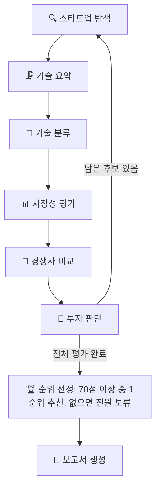
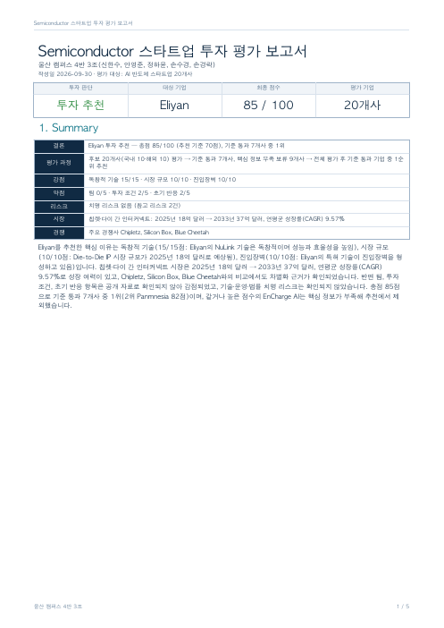
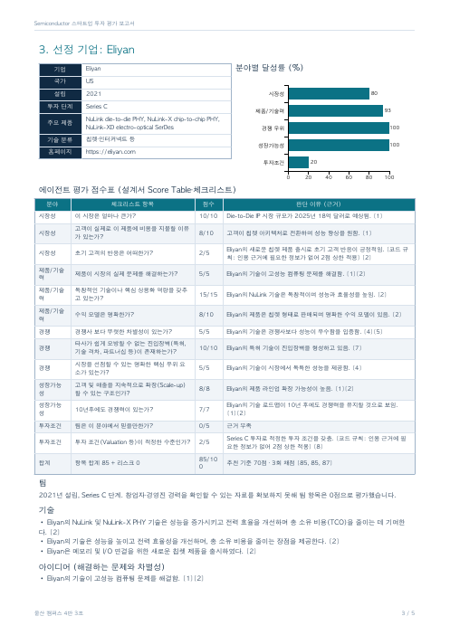

# AI Startup Investment Evaluation Agent

본 프로젝트는 Semiconductor(AI 반도체) 스타트업에 대한 투자 가능성을 자동으로 평가하는 에이전트를 설계하고 구현한 실습 프로젝트입니다.

> **울산 캠퍼스 4반 3조** · 신한수, 안영준, 정하윤, 손수경, 손경락
>
> AI 반도체 스타트업 20개를 7개 에이전트가 근거와 함께 평가하고, 70점 이상 기업 중 1순위를 추천하는 5페이지 투자 보고서를 자동으로 작성합니다.

**발표 순서** · ① Overview → ② 우리 팀의 차별점 → ③ Architecture → ④ Agents → ⑤ RAG 설계 → ⑥ 투자 판단 기준 → ⑦ 결과 → ⑧ 투자 보고서 핵심 포인트 → ⑨ Lessons Learned

---

## ① Overview

- **Domain** : Semiconductor — AI 연산 특화 칩(NPU·AI 가속기·GPU), CXL 메모리, 실리콘 포토닉스, 인메모리 연산, 칩렛 인터커넥트
- **Objective** : AI 스타트업의 시장성, 제품/기술력, 경쟁 우위, 성장가능성, 투자조건을 기준으로 투자 적합성 분석
- **Method** : LangGraph Multi Agent, Agentic RAG(기술 요약·기술 분류·시장성 평가), 웹 검색(경쟁사 비교), LLM Judge(투자 판단)
- **Output** : 전체 후보 평가 → 70점 이상 기업 중 1순위 추천(없으면 전원 보류) → 5페이지 PDF 투자 보고서

| 후보 | 자료 | 평가 기준 | 결과물 |
| --- | --- | --- | --- |
| 20개사 (국내 10 · 해외 10) | 200 / 200페이지 | 설계서 Score Table 100점 + 리스크 감점 | 최종 추천 1개사 + 5페이지 보고서 |

---

## ② 우리 팀의 차별점

| 차별점 | 어떻게 | 효과 |
| --- | --- | --- |
| **근거 추적** | 모든 주장에 출처 URL·페이지·원문 인용을 붙이고, 인용문이 원문에 없으면 코드가 제거 | 환각 수치가 점수·보고서로 흘러가지 않음 |
| **기준은 코드가 계산** | 설계서 Score Table·체크리스트를 코드 상수로 고정(테스트로 검증). LLM은 항목별 점수·근거만 제안하고, 상한·합산·감점·판정은 코드가 계산 | 설계서와 100% 일치, 점수 합계 재현 |
| **채점 안정성** | 동일 입력도 최대 12점 흔들림 → 3회 채점 항목별 중앙값, 팀 경력·밸류에이션 등 필수 정보가 없으면 점수 상한 | 반복 실행해도 판정이 유지됨 |
| **임베딩 선택을 수치로 입증** | KURE(한국어)·Jina(영문 장문) 하이브리드를 정답셋 62문항으로 단일 모델과 비교 | MRR: 기술 0.923 / 시장 0.745, 두 모델 단독보다 높음 |
| **전원 평가 후 1순위** | 첫 추천에서 멈추지 않고 20개사를 모두 평가한 뒤 기준 통과 기업 중 최고점 선택 | "먼저 평가된 기업"이 아닌 "가장 좋은 기업" 추천 |
| **200페이지를 알차게** | 텍스트 없는 PDF 제외, 보도자료는 수치가 있는 앞쪽만 보관, 기술·시장 합산 한도를 코드로 강제 | 200/200페이지, 광고·무관 기사 잡음 제거 |
| **보고서 자동 생성** | 에이전트 결과만으로 요약·표·그래프·인용 번호·가이드 형식 Reference를 갖춘 5페이지 PDF | 명령어 하나로 평가부터 보고서까지 |

---

## ③ Architecture



- 기업 하나마다 기술 → 시장 → 경쟁 → 판단을 거치고, 평가 저장 단계가 인용 출처를 다시 검증합니다. 출처 없는 주장은 제거되고, 핵심 정보(핵심 기술·시장 규모·성장률·경쟁사)가 없으면 보류됩니다.
- 모든 후보를 평가한 뒤 순위를 매기고, 보고서 노드가 최종 State로 PDF를 만듭니다.

---

## ④ Agents

| 에이전트 | RAG | 하는 일 | 산출물 |
| --- | :---: | --- | --- |
| 🔍 스타트업 탐색 | X | 팀이 검증한 후보 20개의 비상장·Seed~Series C·Exit 미완료 적격성 확인 | 후보 목록·출처 |
| 🗜️ 기술 요약 | O | 기술 문서에서 핵심 기술·차별성·장점·한계·상용화 상태를 인용과 함께 정리 | `tech_summary` |
| 🔬 기술 분류 | O | NPU·AI 가속기·GPU·CXL·포토닉스·인메모리 연산 등 분류, 라벨과 근거 문장이 일치하는지 검사 | `tech_category` |
| 📊 시장성 평가 | O | 기술 분야에 맞는 세부 시장 보고서에서 시장 규모·CAGR·대상 고객·수요처 정리 | `market_analysis` |
| 🥊 경쟁사 비교 | X | 웹 검색으로 경쟁사 2~3곳을 찾아 제품·성능·고객·특허·파트너십·양산 역량 비교 | `competitor_analysis` |
| 🧮 투자 판단 | X | 13개 체크리스트 채점(3회 중앙값), 치명 리스크 감점, 기준 통과 여부와 한 줄 이유 | `evaluation_scores`·`evaluation_details` |
| 📝 보고서 생성 | X | 최종 State로 Summary·시장·기업·성장/리스크·Reference 5페이지 PDF 작성 | `output/pdf/investment_report.pdf` |

---

## ⑤ RAG 설계

### 문서 구성 (총 200 / 200페이지)

| 구분 | 페이지 | 문서 | 사용 에이전트 |
| --- | ---: | --- | --- |
| 기술 문서 | 179 | 20개사 홈페이지·제품 문서·논문(arXiv)·보도자료 24건 | 기술 요약·기술 분류 |
| 시장 보고서 | 21 | 6개 세부 시장 시장조사 보도자료 7건 (앞쪽 수치 페이지만) | 시장성 평가 |

### 임베딩 선택 — "리더보드 순위"가 아니라 우리 문서로 측정

- 선정 기준: 오픈소스, 한국어·영어 검색 특화, 장문 스펙·논문 수용, 검색(Retrieval) 용도 학습
- `nlpai-lab/KURE-v1`(한국어 질문·자료) + `jinaai/jina-embeddings-v5-text-small`(영문 스펙·장문)을 질문 특성에 따라 0.7 / 0.3으로 결합

| 검색 | 정답셋 | 하이브리드 | KURE 단독 | Jina 단독 | 무작위 |
| --- | ---: | ---: | ---: | ---: | ---: |
| 기술 (MRR@10) | 46문항 | **0.923** | 0.862 | 0.888 | 0.39 |
| 시장 (MRR@5) | 16문항 | **0.745** | 0.726 | 0.740 | 0.54 |

---

## ⑥ 투자 판단 기준 (RAG-Design 설계서)

| 항목 | 비중 | 체크리스트 (배점) |
| --- | ---: | --- |
| 시장성 | 25 | 시장 크기 (10) · 고객 지불 이유 (10) · 초기 고객 반응 (5) |
| 제품/기술력 | 30 | 실제 문제 해결 (5) · 독창적 기술·상용화 역량 (15) · 수익 모델 (10) |
| 경쟁 우위 | 20 | 차별성 (5) · 진입장벽 (10) · 시장 선점 우위 (5) |
| 성장가능성 | 15 | Scale-up 구조 (8) · 10년 후 경쟁력 (7) |
| 투자조건 | 10 | 팀 신뢰 (5) · 투자 조건·Valuation (5) |
| 리스크 | − | 기술·운영·법률 치명 리스크 유형별 −10 |

- **판정** : 100점 − 리스크 감점 ≥ 70점이면 기준 통과 → 전체 평가 후 기준 통과 기업 중 1순위 추천
- **코드 규칙** : 근거 없는 항목 0점 · 근거 없는 리스크는 감점 안 함 · 팀 경력/밸류에이션/고객 실적 정보가 인용에 없으면 점수 상한

---

## ⑦ 결과 (최근 실행)

| 순위 | 기업 | 총점 | 판단 |
| ---: | --- | ---: | --- |
| 1 | **Eliyan** (칩렛 인터커넥트) | **85** | ✅ **최종 추천** |
| 2 | EnCharge AI | 85 | 보류 (핵심 정보 부족) |
| 3 | Pebble Square | 84 | 보류 (핵심 정보 부족) |
| 4 | Panmnesia | 82 | 기준 통과 |
| 8 | HyperAccel | 79 | 기준 통과 |

- 20개사 중 **7개사가 70점 기준 통과**, 최고점 Eliyan을 추천
- Eliyan 분야별 점수 : 시장성 20/25 · 제품/기술력 28/30 · 경쟁 우위 20/20 · 성장가능성 15/15 · 투자조건 2/10 · 리스크 0 → **85점** (3회 채점 85·85·87)
- LLM 응답과 웹 자료는 시점에 따라 달라져 점수·순위가 실행마다 조금씩 다를 수 있습니다.

---

## ⑧ 투자 보고서 핵심 포인트

| 1. Summary | 3. 선정 기업 |
| :---: | :---: |
|  |  |

- **왜 Eliyan인가** : 독창적 기술(15/15, NuLink PHY의 성능·전력 효율), 시장 규모(칩렛·다이 간 인터커넥트 시장 2025년 18억 → 2033년 37억 달러, CAGR 9.57%), 진입장벽(10/10, 특허 기술)
- **보완할 점** : 팀(0/5)·투자 조건(2/5)·초기 고객 반응(2/5)은 공개 자료로 확인되지 않아 감점 → 투자 전 경영진·밸류에이션 실사 필요
- **리스크** : 치명 리스크 없음, 참고 리스크(상용화 과정 기술 문제, 특허 분쟁 가능성) 2건
- **구성** : 1쪽 한눈에 보는 요약(반 페이지) · 2쪽 선정 시장 · 3쪽 기업·점수표 · 4쪽 성장가능성·리스크 · 5쪽 Reference. 모든 문장에 출처 번호 [n]

---

## ⑨ Lessons Learned

| 문제 | 해결 | 배운 점 |
| --- | --- | --- |
| 정상 인용도 PDF 추출 흔적(`t o`, `end-user`) 때문에 35건 탈락 | 글자 순서는 엄격히, 공백·하이픈·합자만 무시 | 검증은 엄격하되 데이터의 현실을 반영해야 함 |
| 검색 질문에 기업명을 넣자 저자 소개·참고문헌이 1위 | 기업명 제거, 영문 기술 용어 병기 | 필터로 이미 걸러진 정보는 질의에서 잡음 |
| LLM 채점이 후하고 실행마다 최대 12점 흔들림 | 3회 중앙값, 필수 정보 상한 규칙 | LLM은 판단을 제안, 규칙과 계산은 코드가 |
| 한 번에 여러 항목을 요청하면 경쟁사 0~1곳, 성장률 누락 | 단계 분리(경쟁사 추출 → 비교), 누락 필수 항목만 재요청 | 작은 단위의 명확한 요청이 품질을 높임 |
| 기술 분류 라벨이 근거 문장과 모순(PIM 문장에 PHOTONICS) | 라벨-근거 일치 검사로 교정 | 구조화 출력도 교차 검증이 필요 |
| 보도자료 뒤쪽 광고·무관 기사가 페이지와 검색을 낭비 | 수치가 있는 앞쪽만 보관(`max_pages`) | 200페이지 제한은 "무엇을 넣지 않을지"의 문제 |

---

## Features

- PDF·웹 자료 기반 정보 추출 (기술 179페이지 + 시장 21페이지)
- 출처 URL·페이지·원문 인용 검증, 근거가 없으면 `근거 부족`
- 세부 시장(엣지 AI·데이터센터 가속기·CXL·포토닉스·인메모리·칩렛) 규모·성장률 분석
- 경쟁사 2~3곳 6개 항목 비교
- 설계서 Score Table 채점, 항목별 한 줄 이유, 리스크 유형별 감점, 3회 채점 중앙값
- 5페이지 한국어 보고서 자동 생성 (표·그래프·인용 번호·가이드 형식 Reference)
- 검색 품질 평가(Hit Rate@K, MRR), 노드별 경과 출력

## Tech Stack

- Framework : LangGraph
- LLM/Generator : OpenAI gpt-4o-mini (temperature 0)
- LLM/Judge : OpenAI gpt-4o-mini (3회 채점 항목별 중앙값)
- Retrieval : FAISS (IndexFlatIP) - 기술 Hit Rate@3 0.978, MRR@10 0.923 / 시장 Hit Rate@3 0.938, MRR@5 0.745
- Embedding : nlpai-lab/KURE-v1, jinaai/jina-embeddings-v5-text-small (하이브리드)
- Web Search : Tavily · PDF : pypdf, Playwright, ReportLab

## Directory Structure

```text
├── data/                  # 후보 목록, 기술·시장 자료 목록, 검색 정답셋
├── src/investment_scout/
│   ├── agents/            # 탐색·기술 요약·기술 분류·시장성·경쟁사·투자 판단 에이전트
│   ├── rag/               # 수집·파싱·청킹·임베딩·FAISS 검색·생성(프롬프트)·평가·통합 실행
│   ├── reporting/         # 보고서 내용 추출·5페이지 PDF·그래프 노드
│   ├── nodes/             # 후보 선택·평가 저장·순위 선정
│   └── graph.py, state.py # LangGraph 그래프와 State
├── docs/                  # 기술 RAG·역할 3·보고서 상세 안내, 그래프 흐름, 보고서 미리보기
├── tests/                 # 단위·통합 테스트 175개 (API 호출 없음)
├── out/                   # 수집 PDF·인덱스·최종 State (Git 제외)
├── output/pdf/            # 투자 보고서 PDF (Git 제외)
├── app.py                 # 실행 스크립트
└── README.md
```

## Usage

```bash
# 설치 (최초 1회)
uv sync --extra tech-rag --extra embeddings --extra live-search --extra report --group dev
uv run python -m playwright install chromium --only-shell
cp .env.example .env   # OPENAI_API_KEY, TAVILY_API_KEY 입력

# 실행: 자료 준비(최초 1회 자동) → 20개 기업 평가 → output/pdf/investment_report.pdf
uv run python app.py
uv run python app.py --max-candidates 3   # 앞의 3개 기업만 빠르게 확인
uv run python app.py --report-only        # 저장된 결과로 보고서만 다시 생성 (API 호출 없음)

# 테스트
uv run pytest -q
```

실행 중 에이전트마다 산출 결과(인용 페이지, 세부 시장, 경쟁사, 항목별 점수와 이유, 최종 순위)가 출력됩니다. 상세 안내: [기술 RAG](docs/tech_rag.md) · [시장·경쟁·투자 판단](docs/role3.md) · [보고서](docs/report_role4.md)

## Contributors

- 신한수 : (역할 기입)
- 안영준 : (역할 기입)
- 정하윤 : (역할 기입)
- 손수경 : (역할 기입)
- 손경락 : (역할 기입)
