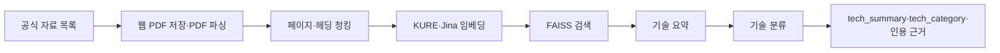

# AI Startup Investment Evaluation Agent

본 프로젝트는 Semiconductor 스타트업의 투자 가능성을 평가하는 에이전트를 설계하고 구현한 실습 프로젝트입니다. 이 문서는 현재 구현한 **2번 담당 영역: 기술 RAG·기술 분류**를 중심으로 작성했습니다.

## Overview

- Objective: 20개 후보 기업의 핵심 기술, 장점·한계, 상용화 상태와 기술 분야를 근거와 함께 정리해 투자 평가에 전달
- Method: LangGraph 에이전트와 PDF·웹 문서 기반 RAG
- 범위: 기술 요약과 기술 분류. 시장성·경쟁·최종 투자 판단 및 보고서는 다른 담당 영역

## Progress

- 20개 기업의 자료 URL 30개를 등록하고, 웹 문서를 PDF로 저장해 전체 **179/200페이지**를 수집했습니다. 본문 텍스트가 없는 PDF 2건(18페이지)은 목록에서 빼고, 자료가 부족했던 Semunite·Pebble Square·XCENA·BOS의 기사·보도자료를 추가했습니다.
- 20개 기업 모두 검색 가능한 본문이 있습니다. 공식 사이트가 차단(HTTP 403)되거나 인증서 오류인 URL 6건은 수집 실패로 기록됩니다.
- 361개 청크로 FAISS 인덱스를 만들었습니다. 기술 분석 결과(gpt-4o-mini, temperature 0)는 근거가 확인된 주장 78개와 인용 79개를 포함하며, 기술 분야는 18개 기업에서 분류되고 2개 기업(iHW, Oxmiq Labs)은 `근거 부족`으로 처리됩니다. temperature 0에서도 재실행 시 1~2개 기업의 분류가 달라질 수 있습니다.
- 20개 기업 46문항 정답셋(`data/retrieval_eval.json`)으로 검색 품질을 측정했습니다. 하이브리드 검색은 **Hit@1 0.870, Hit@3 0.978, MRR@10 0.923**으로 KURE 단독(MRR 0.862)·Jina 단독(0.888)보다 높습니다. 무작위 순위의 MRR은 약 0.39입니다.
- 관련 테스트 144개가 통과했습니다. 수집 자료와 분석 결과는 로컬 `out/`에 있으며 GitHub에는 포함되지 않습니다.

## Features

- 기업 홈페이지·제품 문서·논문·특허·보도자료 수집 및 전체 200페이지 제한
- 웹 문서 PDF 저장, 페이지별 메타데이터 정리, PDF 텍스트 추출과 노이즈 제거
- 헤딩·페이지 기준 청킹 및 KURE/Jina 이중 임베딩을 사용하는 FAISS 검색
- 출처 URL과 PDF 페이지를 포함한 기술 장점·한계·상용화 상태 요약 및 기술 분야 분류
- 확인 가능한 근거가 없을 때 `근거 부족` 반환, 담당 역할 3에 전달할 JSON·자료 ZIP 생성

## Tech Stack

- Framework: LangGraph
- LLM/Generator: OpenAI `gpt-4o-mini` (기술 요약·분류)
- LLM/Judge: OpenAI `gpt-4o-mini` (투자 판단 채점, 3회 채점 중앙값, `OPENAI_JUDGE_MODEL`로 변경 가능)
- Retrieval: FAISS (IndexFlatIP) - Hit Rate@3 0.978, MRR@10 0.923 (46문항, 하이브리드)
- Embedding: `nlpai-lab/KURE-v1`, `jinaai/jina-embeddings-v5-text-small`
- PDF/Web: pypdf, Playwright

## Agents

- 기술 요약 에이전트: 검색 근거에 따라 기술 장점·한계·상용화 상태를 `tech_summary`로 반환
- 기술 분류 에이전트: NPU, AI Accelerator, HBM, EDA/공정 AI 등 기술 분야를 `tech_category`로 반환
- 시장성 평가 에이전트 (RAG): 세부 시장 보고서 근거로 시장 규모·성장률·수요를 `market_analysis`로 반환
- 경쟁사 비교 에이전트: 웹 검색 근거로 경쟁사·비교·진입장벽을 `competitor_analysis`로 반환
- 투자 판단 에이전트: 설계서 Score Table·체크리스트(100점)로 채점, 치명 리스크당 −10점, 70점 이상 `RECOMMENDED`

역할 3의 기준·실행 방법은 [역할 3 안내](docs/role3.md)를 참고하세요.

## Architecture



기술 노드의 기존 LangGraph 연결 방법은 [기술 RAG 실행 안내](docs/tech_rag.md)를 참고하세요.

## Directory Structure

```text
├── data/tech_sources.json                # 20개 기업의 수집 대상 자료
├── src/investment_scout/agents/
│   ├── tech_analyst.py                  # 기술 요약 에이전트
│   └── tech_classifier.py               # 기술 분류 에이전트
├── src/investment_scout/rag/             # 수집·파싱·청킹·임베딩·FAISS·CLI
├── docs/tech_rag.md                      # 설치, 실행 및 역할 3 전달 안내
├── tests/                                # 기술 RAG 검증 테스트
├── out/tech_rag/                         # 수집 PDF·인덱스·결과물 (Git 제외)
├── .env.example                          # 환경변수 예시 (.env는 Git 제외)
└── README.md
```

## Usage

프로젝트 루트(`pyproject.toml`이 있는 폴더)의 터미널에서 실행합니다. 1번은 기존 README의 후보 검증 명령을 사용하고, 이어서 2번의 문서 수집과 기술 분석을 실행합니다. `uv`가 없다면 [기술 RAG 실행 안내](docs/tech_rag.md)의 Windows/macOS `pip` 설치 절차를 따르세요.

### 1번: 후보 탐색·적격성 확인

```bash
uv sync --group dev
uv run investment-scout scout --out out/scout_result.json
```

> `uv sync`는 명령에 지정하지 않은 extra 패키지를 삭제합니다. 2번까지 설치한 뒤 1번의 `uv sync --group dev`를 다시 실행하면 FAISS·임베딩 패키지가 지워지므로, 이후에는 2번의 `uv sync` 명령을 사용하세요.

후보 목록은 `data/candidates_verified.json`에 있습니다. 기존 그래프를 별도로 확인하려면 다음 명령을 사용할 수 있습니다. 현재 `investment-scout run`은 2번의 새 기술 RAG 결과를 자동으로 읽지 않으며, 기술 노드 연결 방법은 [기술 RAG 실행 안내](docs/tech_rag.md)에 설명했습니다.

```bash
uv run investment-scout run --no-embeddings --out out/investment_report.json
```

### 2번: 기술 RAG·기술 분류

`.env.example`을 참고해 `.env`에 OpenAI API 키를 설정합니다. `collect`와 `index`까지는 OpenAI 키가 필요하지 않습니다. `collect`는 일부 URL 수집에 실패해도 성공한 문서를 저장하며 종료 코드가 1일 수 있으므로, 출력과 `out/tech_rag/documents/`의 수집 기록을 확인하세요.

```bash
uv sync --extra tech-rag --extra embeddings --group dev
uv run python -m playwright install chromium --only-shell
uv run python -m investment_scout.rag.cli doctor
uv run python -m investment_scout.rag.cli collect
uv run python -m investment_scout.rag.cli index
uv run python -m investment_scout.rag.cli verify --company HyperAccel
uv run python -m investment_scout.rag.cli evaluate
uv run python -m investment_scout.rag.cli analyze
uv run python -m investment_scout.rag.cli package
uv run pytest -q
```

### 역할 2까지 한 번에 실행 (노드별 경과 확인)

```bash
uv run python -m investment_scout.rag.cli collect      # 자료 수집 (이미 받은 PDF는 재사용)
uv run python -m investment_scout.rag.cli index        # KURE·Jina 인덱스 생성
uv run python -m investment_scout.rag.cli evaluate     # 검색 품질 Hit Rate@K·MRR
uv run python -m investment_scout.rag.cli pipeline     # 탐색→기술 요약→기술 분류 그래프 실행
```

`pipeline`은 설계서 그래프를 실제 탐색·기술 요약·기술 분류 에이전트로 실행하고, 노드가 끝날 때마다 후보 수, 주장 수, 기술 분야, 인용 URL·페이지를 출력합니다. `--max-candidates 3`으로 앞의 3개 기업만 실행할 수 있습니다. 시장성·경쟁사·투자 판단·보고서는 역할 3·4 구현 전까지 자리 표시 노드라 `INSUFFICIENT_DATA`·`HOLD`로 표시됩니다. 최종 State는 `out/tech_rag/pipeline.json`에 저장됩니다.

`verify`는 6개 질문의 검색 결과를 만들지만, 본문이 질문의 답을 실제로 뒷받침하는지는 사람이 확인해야 합니다. `analyze`는 20개 기업의 `tech_summary`·`tech_category`를 `out/tech_rag/analyze.json`에 저장합니다. 역할 3에 넘길 인용 근거와 원본 PDF는 `out/tech_rag/tech_handoff.zip`에 묶입니다. 상세 검증 방법은 [기술 RAG 실행 안내](docs/tech_rag.md)를 참고하세요.

`out/`과 `.env`는 Git에서 제외됩니다. 새 환경에서 다시 수집하면 웹 자료나 OpenAI 응답이 달라질 수 있으므로 결과 파일이 완전히 같다고 보장할 수 없습니다. 같은 PDF 페이지를 기준으로 검토하려면 생성한 자료 ZIP을 별도로 전달해야 합니다.
