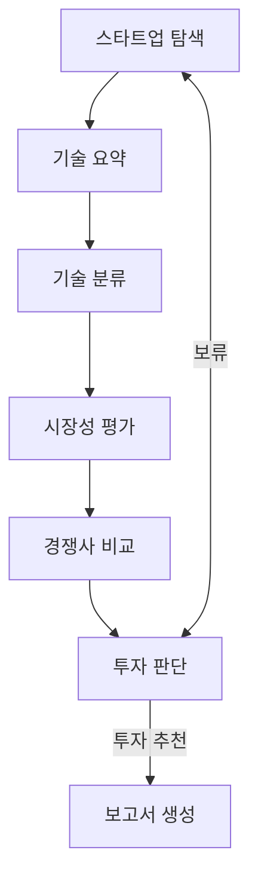

# ai-investment-scout

AI 반도체 스타트업을 탐색하고 근거 기반으로 평가하는 LangGraph 애플리케이션입니다.
후보 선별부터 기술·시장·경쟁사 분석, 투자 판단, 최종 보고서까지 하나의 유한한 그래프로 실행합니다.

## 현재 상태

| 항목 | 상태 |
| --- | --- |
| 검증 후보 | 한국 10개 + 해외 10개, 총 20개 |
| 후보 정보 | 기업명·홈페이지·설립연도·주요 제품·투자 단계·Exit 여부·출처 |
| 적격 범위 | AI 핵심 사업, 비상장, Seed~Series C, 완료된 Exit 없음 |
| 운영 노드 | 출처 기반 기술/시장/경쟁사 분석, 보수적 투자 판단, 보고서 생성 |
| 임베딩 | KURE-v1 + Jina embeddings v5 text small 하이브리드 |
| 테스트 | `92 passed` |

검증 데이터는 [`data/candidates_verified.json`](data/candidates_verified.json)에 있습니다.
각 기업은 최소 2개의 실제 출처와 그 출처가 뒷받침하는 필드를 갖습니다. `NONE_CONFIRMED`는
확인 시점의 공식 기업 자료와 최근 투자 자료에서 완료된 IPO·인수가 발견되지 않았다는 뜻이며,
비공개 거래가 없음을 절대적으로 보증하는 값은 아닙니다.

## 빠른 시작

```bash
cd ~/workspace/ai-investment-scout
uv sync --group dev

# 전체 테스트
uv run pytest -q

# 검증 후보 20개 적격성 확인
uv run investment-scout scout --out out/scout_result.json

# 실제 근거 기반 그래프 실행. 임베딩을 쓰지 않는 빠른 진단 실행
uv run investment-scout run --no-embeddings --out out/investment_report.json

# 공개 Hugging Face 임베딩까지 포함한 운영 실행
uv sync --extra production
uv run investment-scout run --out out/investment_report.json

# 한글 업무 흐름 Mermaid 생성
uv run investment-scout mermaid --out docs/graph.mmd
```

`run`은 기본적으로 검증 데이터에 저장된 실제 출처를 분석합니다. `--search-mode live`를 주면
Tavily 검색을 추가로 수행합니다.

```bash
export TAVILY_API_KEY=...
uv run investment-scout run --search-mode live --out out/live_report.json
```

검색 키가 없거나 검색이 실패해도 mock으로 조용히 전환하지 않습니다. 명시적인 설정 오류 또는
`SYSTEM_ERROR` 진단을 남깁니다. 테스트·데모용 mock은 `investment-scout demo`에서만 사용합니다.

## 그래프



평가 한도는 `min(max_candidates, len(candidate_startups))`입니다. 인덱스는
`record_evaluation`에서만 한 번 증가하므로 무한 루프 없이 종료됩니다. 종료 사유는 다음과 같습니다.

| 값 | 의미 |
| --- | --- |
| `RECOMMENDED_FOUND` | 추천 후보 발견 |
| `ALL_HOLD` | 후보를 모두 평가했으나 전원 보류 |
| `LIMIT_REACHED` | 설정한 최대 평가 수 도달 |
| `NO_ELIGIBLE_CANDIDATES` | 적격 후보 없음 |
| `ZERO_LIMIT` | 평가 한도가 0 |

## State와 노드 계약

기존 필드 `target_domain`, `candidate_startups`, `evaluated_startups`, `current_startup`,
`tech_summary`, `tech_category`, `market_analysis`, `competitor_analysis`, `evaluation_scores`,
`investment_decision`, `hold_reason`, `final_report`를 유지합니다.

추가 필드는 다음과 같습니다.

| 필드 | 용도 |
| --- | --- |
| `candidate_index` | 현재 후보 위치 |
| `max_candidates` | 최대 평가 수 |
| `evaluation_history` | 기업별 분석·판단의 독립적인 깊은 복사본 |
| `source_evidence` | 기업명별 실제 출처 |
| `candidate_profiles` | 기업명별 검증 프로필 |
| `scout_result` | 적격·부적격·검증대기 및 지역별 집계 |
| `termination_reason` | 종료 원인 |
| `diagnostics` | 데이터 부족과 시스템 오류의 구분 기록 |

분석 노드는 다음 `AnalysisResult`를 담당 State 필드에 넣습니다.

```python
{
    "status": "OK",  # OK | INSUFFICIENT_DATA | ERROR
    "data": {},
    "claims": [{
        "claim_id": "claim_001",
        "text": "...",
        "kind": "FACT",  # FACT | INFERENCE
        "source_ids": ["source_001"],
        "data_keys": ["core_technology"],
    }],
    "missing_information": [],
    "errors": [],
}
```

출처가 없거나 존재하지 않는 `source_id`를 참조하는 주장은 확정 이력과 보고서에서 제거됩니다.
필수 분석 정보가 부족하면 `INSUFFICIENT_DATA`가 되고 최종 결정은 `HOLD`로 강제됩니다.
알 수 없는 값을 0이나 추정값으로 채우지 않습니다.

## 후보 탐색과 적격성

`StartupScout`는 이름·별칭·공식 도메인으로 중복을 제거한 뒤 다음을 모두 만족하는 기업만
`candidate_startups`에 넣습니다.

- AI가 핵심 사업이다.
- 비상장 기업이다.
- 최신 확인 투자 단계가 Seed, Pre-Series A, Series A, B 또는 C다.
- 완료된 IPO·인수가 확인되지 않았다.
- 홈페이지, 설립연도, 제품, 투자 단계, Exit 판정을 뒷받침하는 실제 출처가 있다.

미확인 필드가 하나라도 있거나 검색에서 단지 Exit 기사를 찾지 못했을 뿐이면
`NEEDS_VERIFICATION`으로 분리합니다. 과거 투자 기사만 있고 최신 확인일이 없거나 365일을 넘으면
투자 단계도 재검증 대상으로 처리합니다.

## 오픈소스 임베딩 전략

구현은 [`src/investment_scout/retrieval/embeddings.py`](src/investment_scout/retrieval/embeddings.py)에 있습니다.

- 한국어 중심의 짧은 일반 문맥: `nlpai-lab/KURE-v1`
- 영문 전문용어가 많거나 한영 혼합·장문: `jinaai/jina-embeddings-v5-text-small`
- 기본 `hybrid`: 두 모델의 cosine 점수를 모델별로 정규화한 뒤 질의의 한국어 비중에 따라 가중 결합

두 모델의 벡터 차원이 달라도 벡터 자체를 합치지 않고 점수 단계에서 결합하므로 안전합니다.
모델은 `sentence-transformers`로 지연 로드하며 최초 실행 때 Hugging Face에서 다운로드됩니다.

## 실제 출처 기반 분석의 보수성

[`src/investment_scout/nodes/production.py`](src/investment_scout/nodes/production.py)는 후보의 실제
프로필·출처만 사용합니다. 현재 후보 데이터는 기본 기업 정보와 제품·투자 단계 검증에 집중되어
있으므로, 시장 규모·성장률·경쟁사 근거가 없는 기업은 그 값을 만들지 않고 `HOLD` 처리합니다.
이는 코드 미구현이 아니라 근거가 부족한 투자를 추천하지 않기 위한 의도적인 정책입니다.

## 담당 에이전트 연결

각 담당자는 아래 키로 자신의 노드 함수를 전달하면 됩니다. 기술 요약과 기술 분류는 독립된
노드이며 실제 실행 순서도 `tech_node → category_node → market_node`입니다.

```python
app = build_graph(
    scout=startup_scout,
    tech_node=tech_summary_agent,
    category_node=tech_classification_agent,
    market_node=market_evaluation_agent,
    competitor_node=competitor_comparison_agent,
    decision_node=investment_decision_agent,
    report_node=report_agent,
)
```

`tech_node`는 `{"tech_summary": AnalysisResult}`만 반환하고, `category_node`는
`{"tech_category": "분류값"}`만 반환해야 합니다.

## 테스트

```bash
uv run pytest -q
# 93 passed
```

주요 검증 범위:

- 추천 후보 1개 즉시 종료, 후보 2개 전원 HOLD, HOLD 후 다음 후보 이동
- 후보 20개 전원 HOLD 시 recursion 오류 없이 종료
- 후보 소진·평가 한도 0·빈 후보·잘못된 결정 값 처리
- 기업명/도메인 중복 제거와 적격성 검증
- 검증 데이터 10+10, 필수 필드, 실제 URL, 전역 고유 source ID
- 출처 없는 주장과 dangling source ID 제거
- 정보 부족 시 `INSUFFICIENT_DATA` 및 HOLD 강제
- KURE/Jina 자동 라우팅과 하이브리드 점수 결합
- 운영 노드가 mock 내용 없이 실제 출처를 사용해 종료

## 파일 구조

```text
src/investment_scout/
├── state.py
├── contracts.py
├── evidence.py
├── eligibility.py
├── graph.py
├── agents/startup_scout.py
├── nodes/orchestration.py
├── nodes/production.py
├── retrieval/embeddings.py
├── search/
├── mocks/
└── cli.py

data/candidates_verified.json  # 기본 검증 후보 20개
docs/graph.mmd
tests/
```

## 아직 사람의 정책 결정이 필요한 항목

시스템 동작과 요구 기능은 구현되어 있지만, 실제 투자 추천 기준은 조직의 승인된 평가표가 필요합니다.
현재 운영 노드는 정량 기준이 승인되지 않은 경우 추천을 만들지 않고 보수적으로 HOLD합니다.
향후 합의가 필요한 값은 점수 항목과 임계치, 시장·경쟁사 필수 근거의 범위, 투자 단계 자료의
유효기간(현재 365일)입니다.
