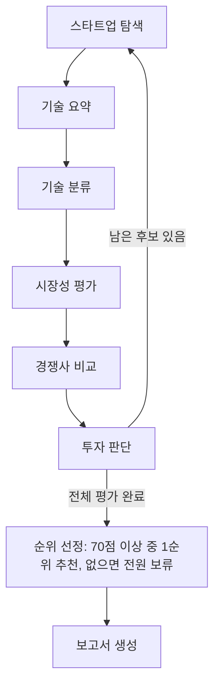

# AI Startup Investment Evaluation Agent

본 프로젝트는 Semiconductor(AI 반도체) 스타트업에 대한 투자 가능성을 자동으로 평가하는 에이전트를 설계하고 구현한 실습 프로젝트입니다.

## Overview

- Objective: AI 반도체 스타트업 20개(국내 10, 해외 10)의 기술력, 시장성, 경쟁 우위, 성장 가능성, 투자 조건을 기준으로 투자 적합성 분석
- Method: LangGraph Multi Agent, Agentic RAG(기술 요약·기술 분류·시장성 평가), 웹 검색(경쟁사 비교), LLM Judge(투자 판단)
- Domain: Semiconductor — AI 연산 특화 칩(NPU·AI 가속기·GPU), CXL 메모리, 실리콘 포토닉스, 인메모리 연산, 칩렛 인터커넥트

## Progress

- 역할 1~3(후보 탐색, 기술 RAG·분류, 시장·경쟁·투자 판단)과 역할 4(5페이지 PDF 보고서 생성)가 하나의 그래프로 연결됩니다.
- 자료: 기술 문서 179페이지 + 시장 보고서 21페이지 = **200/200페이지**. 기술 361개, 시장 39개 청크로 FAISS 인덱스를 만듭니다.
- 검색 품질: 기술 46문항 **Hit@3 0.978, MRR@10 0.923**, 시장 16문항 **Hit@3 0.938, MRR@5 0.745** (하이브리드, KURE·Jina 단독보다 높음).
- `pipeline`으로 20개 기업 전체 평가와 순위 선정까지 오류 없이 실행되는 것을 확인했습니다. LLM 응답에 따라 점수·순위는 실행마다 조금씩 달라질 수 있습니다.
- 테스트 168개 통과 (`uv run pytest -q`, 모델 다운로드·API 호출 없음).

## Features

- 기업 홈페이지·제품 문서·논문·특허·보도자료와 시장조사 보도자료 수집, 기술·시장 자료 합산 200페이지 제한
- 웹 문서 PDF 저장, 페이지별 메타데이터, 노이즈(뒤쪽 광고·관련 기사) 제외를 위한 앞쪽 페이지 보관(`max_pages`)
- 헤딩·페이지 기준 청킹, KURE-v1·Jina v5 이중 임베딩 하이브리드 검색(FAISS)
- 모든 주장에 출처 URL·페이지·원문 인용을 붙이고, 원문에 없는 인용은 제거. 근거가 없으면 `근거 부족`
- 경쟁사 2~3곳을 웹 검색으로 찾아 제품·성능·고객·특허·파트너십·양산 역량별 비교
- 설계서 Score Table·체크리스트(100점)로 채점하고 항목별 점수와 한 줄 이유, 리스크 감점을 기록
- 전체 후보 평가 후 70점 이상 기업 중 1순위 추천, 없으면 전원 보류
- 역할 3의 점수·리스크·출처를 검산해 Summary부터 Reference까지 5페이지 PDF 보고서 생성
- 검색 품질 평가(Hit Rate@K, MRR)와 노드별 경과를 출력하는 통합 실행 명령

## Tech Stack

- Framework: LangGraph
- LLM/Generator: OpenAI `gpt-4o-mini` (기술 요약·분류·시장성·경쟁사, 코드에 고정, temperature 0)
- LLM/Judge: OpenAI `gpt-4o-mini` (투자 판단 채점, 3회 채점 항목별 중앙값)
- Retrieval: FAISS (IndexFlatIP) — 기술 Hit Rate@3 0.978, MRR@10 0.923 / 시장 Hit Rate@3 0.938, MRR@5 0.745
- Embedding: `nlpai-lab/KURE-v1`(한국어), `jinaai/jina-embeddings-v5-text-small`(영문·장문), 질문 특성에 따라 0.7/0.3 가중 결합
- Web Search: Tavily (경쟁사 비교)
- PDF/Web: pypdf, Playwright, ReportLab(보고서 PDF)

## Agents

| 에이전트 | RAG | 역할 |
| --- | --- | --- |
| 🔍 스타트업 탐색 | X | 팀이 검증한 후보 20개를 읽어 비상장·Seed~Series C·Exit 미완료 적격성 확인 |
| 🗜️ 기술 요약 | O | 기술 문서에서 핵심 기술·차별성·장점·한계·상용화 상태를 인용과 함께 `tech_summary`로 반환 |
| 🔬 기술 분류 | O | NPU·AI 가속기·GPU·CXL·포토닉스·인메모리 연산 등 분야를 `tech_category`로 반환 (라벨-근거 일치 검사) |
| 📊 시장성 평가 | O | 기술 분야에 맞는 세부 시장 보고서에서 시장 규모·CAGR·수요를 `market_analysis`로 반환 |
| 🥊 경쟁사 비교 | X | 웹 검색으로 경쟁사 2~3곳과 6개 항목별 비교·진입장벽을 `competitor_analysis`로 반환 |
| 🧮 투자 판단 | X | Score Table·체크리스트 채점, 리스크 감점, 기준 통과 여부와 근거를 `evaluation_scores`·`evaluation_details`로 반환 |
| 📝 보고서 생성 | X | 역할 3 결과를 검산하고 실제 사용한 출처만 포함한 5페이지 PDF와 Markdown 요약 생성 |

### 투자 판단 기준 (RAG-Design 설계서)

| 항목 | 비중 | 체크리스트 (배점) |
| --- | --- | --- |
| 시장성 | 25 | 시장 크기 (10), 고객 지불 이유 (10), 초기 고객 반응 (5) |
| 제품/기술력 | 30 | 실제 문제 해결 (5), 독창적 기술·상용화 역량 (15), 수익 모델 (10) |
| 경쟁 우위 | 20 | 차별성 (5), 진입장벽 (10), 시장 선점 우위 (5) |
| 성장가능성 | 15 | Scale-up 구조 (8), 10년 후 경쟁력 (7) |
| 투자조건 | 10 | 팀 신뢰 (5), 투자 조건·Valuation (5) |
| 리스크 | – | 기술·운영·법률 치명 리스크 유형별 −10 |

LLM은 항목별 점수·근거만 제안하고 배점 상한, 근거 없는 항목 0점, 합산, 감점, 판정은 코드가 계산합니다. 자세한 규칙은 [역할 3 안내](docs/role3.md)를 참고하세요.

## Architecture



## Directory Structure

```text
├── data/
│   ├── candidates_verified.json         # 후보 20개 (팀 검증)
│   ├── tech_sources.json                # 기술 문서 목록 (179페이지)
│   ├── market_sources.json              # 시장 보고서 목록 (21페이지)
│   ├── retrieval_eval.json              # 기술 검색 정답셋 (46문항)
│   └── market_retrieval_eval.json       # 시장 검색 정답셋 (16문항)
├── src/investment_scout/
│   ├── agents/                          # 탐색·기술 요약·기술 분류·시장성·경쟁사·투자 판단 에이전트
│   ├── rag/                             # 수집·파싱·청킹·임베딩·FAISS·생성·평가·통합 실행(CLI)
│   ├── reporting/                       # 역할 4 입력 계약·PDF 생성·LangGraph 노드·CLI
│   ├── graph.py, state.py               # LangGraph 그래프와 State
│   └── nodes/                           # 후보 선택·평가 저장·순위 선정
├── docs/
│   ├── tech_rag.md                      # 기술 RAG 설치·실행·검증
│   ├── role3.md                         # 시장·경쟁·투자 판단 기준과 실행
│   ├── report_role4.md                  # 역할 3 연동 계약과 PDF 실행 안내
│   └── graph.mmd                        # 그래프 흐름
├── tests/                               # 단위·통합 테스트 (API 호출 없음)
├── out/                                 # 수집 PDF·인덱스·실행 결과 (Git 제외)
├── output/                              # 생성된 보고서 PDF (Git 제외)
├── .env.example                         # 환경변수 예시 (.env는 Git 제외)
└── README.md
```

## Usage

프로젝트 루트에서 실행합니다. `.env.example`을 복사해 `.env`를 만들고 `OPENAI_API_KEY`, `TAVILY_API_KEY`를 입력합니다.

```bash
# 설치 (extra를 모두 지정: uv sync는 지정하지 않은 extra를 삭제합니다)
uv sync --extra tech-rag --extra embeddings --extra live-search --extra report --group dev
uv run python -m playwright install chromium --only-shell

# 자료 수집·인덱스 (기술 + 시장, 합산 200페이지 검사)
uv run python -m investment_scout.rag.cli collect
uv run python -m investment_scout.rag.cli index
uv run python -m investment_scout.rag.cli collect --manifest data/market_sources.json --directory out/market_rag/documents
uv run python -m investment_scout.rag.cli index --corpus out/market_rag/documents/corpus.json --index out/market_rag/index

# 검색 품질 (OpenAI 호출 없음)
uv run python -m investment_scout.rag.cli evaluate
uv run python -m investment_scout.rag.cli evaluate --index out/market_rag/index --eval data/market_retrieval_eval.json --k 1 3 5 --out out/market_rag/evaluate.json

# 전체 그래프 실행: 노드별 경과, 항목별 점수·이유, 최종 순위 출력
uv run python -m investment_scout.rag.cli pipeline --max-candidates 3   # 앞의 3개 기업만
uv run python -m investment_scout.rag.cli pipeline                      # 20개 전체

# 테스트
uv run pytest -q
```

`pipeline`의 마지막 보고서 노드는 역할 4의 5페이지 PDF를 `output/pdf/investment_report.pdf`에 생성합니다. 경로는 `--report-pdf`로 바꿀 수 있습니다.

### 보고서만 다시 생성

역할 3의 전체 State 또는 인계 JSON으로 PDF를 만듭니다. `data/report_demo.json`은 레이아웃 확인용 합성 데모이며 실제 투자 자료가 아닙니다.

```bash
uv run investment-report --input out/tech_rag/pipeline.json --out output/pdf/investment_report.pdf
uv run investment-report --input data/report_demo.json --out output/pdf/role4_demo_report.pdf
```

입력 필드, `evaluation_history` 자동 변환, LangGraph 연결 방법은 [역할 4 보고서 계약](docs/report_role4.md)을 참고하세요. 역할 4는 역할 3의 점수와 판단을 변경하지 않고 합계와 출처 연결만 검증합니다.

`collect`는 접근이 차단된 일부 URL 때문에 종료 코드 1을 반환할 수 있으며, 성공한 자료는 그대로 사용합니다. 최종 State는 `out/tech_rag/pipeline.json`에 저장됩니다. 상세 절차는 [기술 RAG 실행 안내](docs/tech_rag.md), [역할 3 안내](docs/role3.md), [역할 4 보고서 계약](docs/report_role4.md)을 참고하세요.

`out/`, `output/`, `.env`는 Git에서 제외됩니다. 웹 자료와 OpenAI 응답은 시점에 따라 달라질 수 있어 결과가 완전히 같다고 보장하지 않습니다.

## Contributors

- 신한수 : (역할 기입)
- 안영준 : (역할 기입)
- 정하윤 : (역할 기입)
- 손수경 : (역할 기입)
- 손경락 : (역할 기입)
